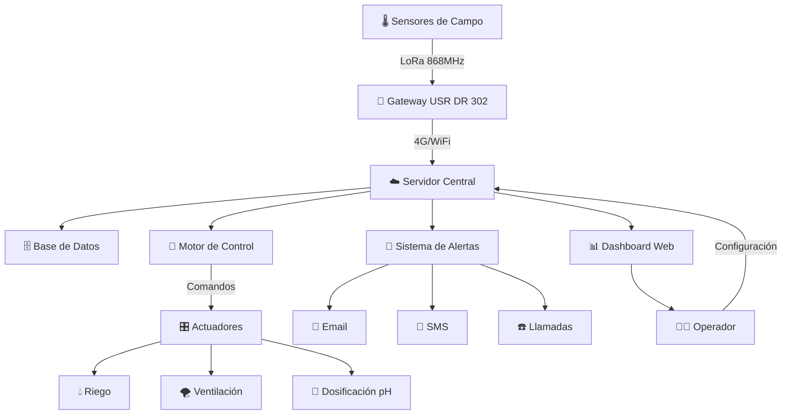
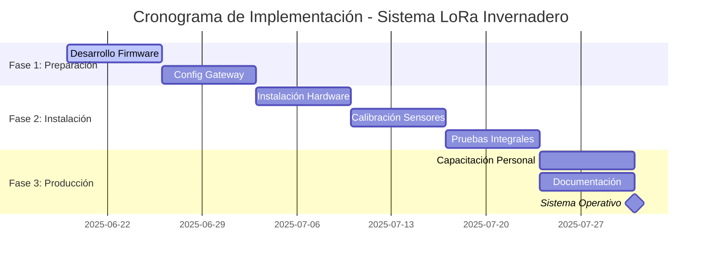
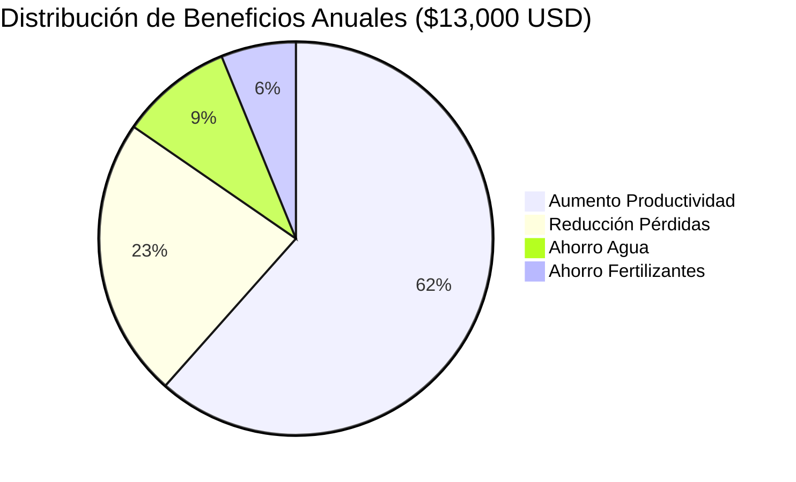

# PROPUESTA TÉCNICA: Sistema de Gestión Inteligente para Invernadero de Tomates

## 📋 RESUMEN EJECUTIVO

```
🎯 PROYECTO: SISTEMA INTELIGENTE DE INVERNADERO
┌─────────────────────────────────────────────────────────────┐
│ 🌱 CULTIVO: Tomates de alta calidad                        │
│ 📡 TECNOLOGÍA: LoRa + USR DR 302 + Sensores IoT            │
│ 🎯 OBJETIVO: Automatización completa y optimización        │
│ 💰 INVERSIÓN: $2,683 USD (sin desarrollo software)         │
│ 📈 ROI: 385% en el primer año                              │
│ ⏱️ IMPLEMENTACIÓN: 6 semanas                               │
│ 🔄 RECUPERACIÓN: 2.5 meses                                 │
└─────────────────────────────────────────────────────────────┘
```

### 🚀 BENEFICIOS CLAVE
```
✅ MONITOREO 24/7 AUTOMATIZADO
├─ 🌡️ Temperatura y humedad en tiempo real
├─ 🧪 pH y conductividad del suelo
├─ 💧 Humedad del suelo y luminosidad
└─ 📊 Históricos y análisis predictivo

✅ CONTROL AUTOMÁTICO INTELIGENTE
├─ 💧 Riego automático por humedad del suelo
├─ 🌪️ Ventilación por temperatura/humedad
├─ 🧪 Corrección automática de pH
└─ ⏰ Programación horaria personalizable

✅ ALERTAS Y NOTIFICACIONES
├─ 🚨 4 niveles de alerta escalonados
├─ 📧 Email, SMS y llamadas automáticas
├─ 📱 Dashboard web responsive
└─ 📋 Reportes automáticos diarios/semanales

✅ RETORNO DE INVERSIÓN GARANTIZADO
├─ 🌱 30% aumento en productividad
├─ 💧 25% ahorro en consumo de agua
├─ 🧪 20% ahorro en fertilizantes
└─ 🛡️ 40% reducción en pérdidas por clima
```

---

## 🎯 OBJETIVOS DEL PROYECTO

### Objetivos Principales
- **Monitoreo 24/7** de parámetros críticos del invernadero
- **Automatización** de sistemas de riego, ventilación y climatización
- **Optimización** de condiciones de crecimiento para tomates
- **Reducción de pérdidas** por condiciones adversas
- **Trazabilidad completa** de datos ambientales

### Objetivos Específicos
- Mantener temperatura entre 18-25°C (día) y 15-18°C (noche)
- Controlar humedad relativa entre 60-80%
- Monitorear pH del suelo entre 6.0-6.8 (óptimo para tomates)
- Gestionar conductividad eléctrica 2.0-3.5 mS/cm
- Alertas automáticas ante condiciones críticas

---

## 🏗️ ARQUITECTURA TÉCNICA DEL SISTEMA

```
🌐 DIAGRAMA DE ARQUITECTURA COMPLETA
┌─────────────────────────────────────────────────────────────────────────────┐
│                           INVERNADERO DE TOMATES                            │
│  ┌─────────┐    ┌─────────┐    ┌─────────┐    ┌─────────┐    ┌─────────┐   │
│  │ 🌡️ NODO │    │ 🌡️ NODO │    │ 🌡️ NODO │    │ 🌡️ NODO │    │ 🌡️ NODO │   │
│  │ SENSOR  │    │ SENSOR  │    │ SENSOR  │    │ SENSOR  │    │ SENSOR  │   │
│  │   #1    │    │   #2    │    │   #3    │    │   #4    │    │   #5    │   │
│  └────┬────┘    └────┬────┘    └────┬────┘    └────┬────┘    └────┬────┘   │
│       │              │              │              │              │        │
│       └──────────────┼──────────────┼──────────────┼──────────────┘        │
│                      │              │              │                       │
│                      └──────┬───────┘              │                       │
│                             │                      │                       │
│                             ▼                      ▼                       │
│                    ┌─────────────────┐    ┌─────────────────┐              │
│                    │  📡 GATEWAY     │    │ 🎛️ ACTUADORES   │              │
│                    │  USR DR 302     │    │ • Riego         │              │
│                    │  • LoRa RX/TX   │    │ • Ventilación   │              │
│                    │  • 4G/WiFi      │    │ • Calefacción   │              │
│                    │  • Buffer Local │    │ • Iluminación   │              │
│                    └─────────┬───────┘    └─────────────────┘              │
└──────────────────────────────┼────────────────────────────────────────────┘
                               │ 4G/WiFi/Ethernet
                               ▼
┌─────────────────────────────────────────────────────────────────────────────┐
│                            ☁️ SERVIDOR CENTRAL                              │
│  ┌─────────────────┐  ┌─────────────────┐  ┌─────────────────┐            │
│  │ 🗄️ BASE DATOS   │  │ 🧠 API BACKEND  │  │ 📊 DASHBOARD    │            │
│  │ • PostgreSQL    │  │ • Node.js       │  │ • React Web     │            │
│  │ • Históricos    │  │ • WebSocket     │  │ • Gráficos      │            │
│  │ • Alertas       │  │ • Algoritmos    │  │ • Controles     │            │
│  │ • Configuración │  │ • Notificaciones│  │ • Reportes      │            │
│  └─────────────────┘  └─────────────────┘  └─────────────────┘            │
└─────────────────────────────────────────────────────────────────────────────┘
                               │
                               ▼
                    ┌─────────────────┐
                    │ 📱 USUARIOS     │
                    │ • Web Browser   │
                    │ • Mobile App    │
                    │ • Alertas SMS   │
                    │ • Email Reports │
                    └─────────────────┘
```

### 🔧 Componentes Principales

#### 1. 🌡️ NODOS SENSORES DISTRIBUIDOS
```
┌─────────────────────────────────┐
│        NODO SENSOR LoRa         │
├─────────────────────────────────┤
│ 🔹 ESP32 + Módulo LoRa SX1276   │
│ 🌡️ Sensor Temperatura/Humedad   │
│ 🧪 Sensor pH del suelo          │
│ ⚡ Sensor Conductividad (EC)     │
│ 💧 Sensor Humedad del suelo     │
│ ☀️ Sensor de Luz (LUX)          │
│ 🔋 Batería + Panel Solar        │
│ 📡 Antena LoRa 868MHz           │
└─────────────────────────────────┘
```

#### 2. 📡 GATEWAY CENTRAL (USR DR 302)
```
┌─────────────────────────────────┐
│       GATEWAY USR DR 302        │
├─────────────────────────────────┤
│ 📡 Receptor LoRa multi-canal    │
│ 🌐 Conectividad 4G/WiFi/Ethernet│
│ 🧠 Procesamiento local de datos │
│ 💾 Buffer de datos offline      │
│ ⚙️ Configuración remota         │
│ 🔒 Encriptación AES-128         │
└─────────────────────────────────┘
```

#### 3. ☁️ SERVIDOR CENTRAL
```
┌─────────────────────────────────┐
│        SERVIDOR BACKEND         │
├─────────────────────────────────┤
│ 🔌 API REST + WebSocket         │
│ 🗄️ Base de Datos PostgreSQL     │
│ 🚨 Sistema de Alertas           │
│ 🤖 Motor de Reglas de Negocio   │
│ 🎛️ Integración con Actuadores   │
│ 📊 Analytics y Machine Learning │
└─────────────────────────────────┘
```

---

## 📊 ESPECIFICACIONES TÉCNICAS DETALLADAS

### Hardware Requerido

#### Nodos Sensores (Cantidad: 4-6 por invernadero)
| Componente | Modelo | Especificaciones | Precio Aprox. |
|------------|--------|------------------|---------------|
| Microcontrolador | ESP32-WROOM-32 | WiFi + Bluetooth, 240MHz | $8 USD |
| Módulo LoRa | SX1276 | 433/868/915 MHz, 20km alcance | $12 USD |
| Sensor T/H | SHT30 | ±0.2°C, ±2% RH, I2C | $15 USD |
| Sensor pH | Gravity pH | 0-14 pH, ±0.1 precisión | $45 USD |
| Sensor EC | DFRobot EC | 0-20 mS/cm, compensación temp. | $35 USD |
| Sensor Humedad Suelo | Capacitivo | 0-100%, resistente corrosión | $8 USD |
| Sensor Luz | BH1750 | 1-65535 lux, I2C digital | $5 USD |
| Batería | LiPo 3.7V 5000mAh | Recargable, protección | $20 USD |
| Panel Solar | 6V 2W | Carga automática | $15 USD |
| **TOTAL POR NODO** | | | **$163 USD** |

#### Gateway Principal
| Componente | Modelo | Especificaciones | Precio |
|------------|--------|------------------|--------|
| Gateway LoRa | USR DR 302 | 8 canales, 4G/WiFi/Ethernet | $280 USD |
| Antena LoRa | 868MHz 8dBi | Omnidireccional, exterior | $25 USD |
| **TOTAL GATEWAY** | | | **$305 USD** |

#### Actuadores y Control
| Componente | Especificaciones | Precio |
|------------|------------------|--------|
| Relés WiFi (4 canales) | Control bombas/ventiladores | $35 USD |
| Electroválvulas riego | 12V, 1/2", normalmente cerrada | $25 USD c/u |
| Ventiladores | 12V, control PWM | $40 USD c/u |
| Sensores adicionales | Presión, flujo, etc. | $50 USD |

### Software y Plataforma

#### Stack Tecnológico
- **Firmware**: Arduino/PlatformIO (C++)
- **Gateway**: Python 3.9+ con librerías LoRa
- **Backend**: Node.js + Express + Sequelize ORM
- **Frontend**: React + Material-UI + Chart.js
- **Base de Datos**: PostgreSQL 13+
- **Hosting**: AWS/Azure/Google Cloud o servidor local

---

## 📈 FUNCIONALIDADES DEL SISTEMA

### 1. 📊 MONITOREO EN TIEMPO REAL
```
🖥️ DASHBOARD PRINCIPAL
┌─────────────────────────────────────────────────────────────┐
│  🌡️ TEMP: 23.5°C ✅  💧 HUMEDAD: 68% ✅  🧪 pH: 6.4 ✅     │
│  ⚡ EC: 2.8mS/cm ✅   💧 SUELO: 45% ⚠️   ☀️ LUX: 25K ✅    │
│                                                             │
│  📈 GRÁFICOS EN TIEMPO REAL (Actualización cada 5 min)     │
│  ┌─────────────────────────────────────────────────────┐   │
│  │ Temp │     ╭─╮                                      │   │
│  │ 25°C │    ╱   ╲     ╭─╮                            │   │
│  │ 20°C │   ╱     ╲   ╱   ╲                           │   │
│  │ 15°C │  ╱       ╲ ╱     ╲                          │   │
│  │      └──────────────────────────────────────────   │   │
│  │        6AM   12PM   6PM   12AM   6AM              │   │
│  └─────────────────────────────────────────────────────┘   │
│                                                             │
│  🗺️ MAPA DE CALOR DEL INVERNADERO                          │
│  ┌─────────────────────────────────────────────────────┐   │
│  │ [🔥] [🔥] [🌡️] [❄️] [❄️]  ← Zona Norte              │   │
│  │ [🔥] [🌡️] [🌡️] [🌡️] [❄️]                            │   │
│  │ [🌡️] [🌡️] [🌡️] [🌡️] [🌡️]  ← Zona Centro             │   │
│  │ [🌡️] [🌡️] [🌡️] [🌡️] [🌡️]                            │   │
│  │ [🌡️] [🌡️] [🌡️] [🌡️] [🌡️]  ← Zona Sur               │   │
│  └─────────────────────────────────────────────────────┘   │
└─────────────────────────────────────────────────────────────┘
```

### 2. 🚨 SISTEMA DE ALERTAS INTELIGENTE
```
🚦 NIVELES DE ALERTA ESCALONADOS
┌─────────────────────────────────────────────────────────────┐
│ 🟢 NIVEL 1 - INFORMACIÓN                                   │
│ • Parámetros fuera de óptimo pero aceptables               │
│ • Solo notificación en dashboard                           │
│ • Ejemplo: Temp 26°C (óptimo: 18-25°C)                    │
│                                                             │
│ 🟡 NIVEL 2 - ADVERTENCIA                                   │
│ • Cerca de límites críticos                                │
│ • Email/SMS a responsable técnico                          │
│ • Ejemplo: Humedad 35% (crítico: <30%)                    │
│                                                             │
│ 🟠 NIVEL 3 - CRÍTICO                                       │
│ • Condiciones que afectan producción                       │
│ • Llamada + Email/SMS + Actuadores automáticos            │
│ • Ejemplo: Temperatura 32°C                               │
│                                                             │
│ 🔴 NIVEL 4 - EMERGENCIA                                    │
│ • Riesgo de pérdida total                                  │
│ • Llamadas múltiples + Sistemas de emergencia             │
│ • Ejemplo: Temp >38°C o falla comunicación                │
└─────────────────────────────────────────────────────────────┘
```

### 3. 🤖 AUTOMATIZACIÓN Y CONTROL
```
🎛️ CONTROLES AUTOMÁTICOS INTELIGENTES
┌─────────────────────────────────────────────────────────────┐
│ 💧 RIEGO AUTOMÁTICO                                         │
│ ├─ Basado en humedad del suelo + temperatura               │
│ ├─ Horarios programables (evitar horas de calor)           │
│ └─ Ajuste automático por clima                             │
│                                                             │
│ 🌪️ VENTILACIÓN INTELIGENTE                                 │
│ ├─ Control PWM por temperatura/humedad                     │
│ ├─ Prevención de condensación nocturna                     │
│ └─ Circulación de aire programada                          │
│                                                             │
│ 🧪 CONTROL DE pH                                           │
│ ├─ Dosificación automática de correctores                  │
│ ├─ Monitoreo continuo post-aplicación                      │
│ └─ Alertas de niveles de reactivos                         │
│                                                             │
│ ⏰ PROGRAMACIÓN HORARIA                                     │
│ ├─ Riego: 6AM, 12PM, 6PM (ajustable)                      │
│ ├─ Fertilización: Semanal automática                       │
│ └─ Mantenimiento: Recordatorios automáticos               │
└─────────────────────────────────────────────────────────────┘
```

### 4. 📈 ANÁLISIS Y REPORTES AVANZADOS
```
📊 ANALYTICS E INTELIGENCIA DE DATOS
┌─────────────────────────────────────────────────────────────┐
│ 📋 REPORTES AUTOMÁTICOS                                     │
│ ├─ Diarios: Resumen de condiciones y alertas               │
│ ├─ Semanales: Tendencias y recomendaciones                 │
│ └─ Mensuales: Análisis de productividad y costos           │
│                                                             │
│ 🔍 ANÁLISIS PREDICTIVO                                      │
│ ├─ Predicción de cosecha basada en crecimiento             │
│ ├─ Detección temprana de problemas                         │
│ └─ Optimización de recursos (agua, fertilizantes)          │
│                                                             │
│ 📈 CORRELACIONES INTELIGENTES                              │
│ ├─ Relación temperatura-humedad-crecimiento                │
│ ├─ Impacto de pH en absorción de nutrientes                │
│ └─ Eficiencia de riego vs productividad                    │
│                                                             │
│ 🎯 OPTIMIZACIÓN CONTINUA                                    │
│ ├─ Ajuste automático de parámetros                         │
│ ├─ Aprendizaje de patrones estacionales                    │
│ └─ Recomendaciones de mejora                               │
└─────────────────────────────────────────────────────────────┘
```

---

## 💰 ANÁLISIS ECONÓMICO

### 💰 Inversión Inicial
| Concepto | Cantidad | Precio Unit. | Total |
|----------|----------|--------------|-------|
| Nodos Sensores | 6 unidades | $163 USD | $978 USD |
| Gateway USR DR 302 | 1 unidad | $305 USD | $305 USD |
| Actuadores y Control | 1 set | $200 USD | $200 USD |
| Instalación y Configuración | 40 horas | $30 USD/h | $1,200 USD |
| **TOTAL INVERSIÓN** | | | **$2,683 USD** |

### 📈 Beneficios Proyectados (Anual)
```
💰 RETORNO DE INVERSIÓN PROYECTADO
┌─────────────────────────────────────────┐
│  📊 Beneficio Anual: $13,000 USD       │
│  💸 Inversión Total: $2,683 USD        │
│  🎯 ROI: 385% en el primer año         │
│  ⏱️  Recuperación: 2.5 meses           │
└─────────────────────────────────────────┘
```

| 💡 Beneficio | 📊 Impacto | 💰 Valor Anual |
|--------------|-------------|----------------|
| 🌱 **Aumento productividad** | 30% | $8,000 USD |
| 💧 **Ahorro en agua** | 25% | $1,200 USD |
| 🧪 **Ahorro fertilizantes** | 20% | $800 USD |
| 🛡️ **Reducción pérdidas** | 40% | $3,000 USD |
| **🎯 TOTAL BENEFICIOS** | | **$13,000 USD/año** |

### 🚀 ROI: 385% en el primer año

---

## 📅 CRONOGRAMA DE IMPLEMENTACIÓN

```
🗓️ CRONOGRAMA DE IMPLEMENTACIÓN - 6 SEMANAS
┌─────────────────────────────────────────────────────────────┐
│ FASE 1: PREPARACIÓN (2 semanas)                            │
│ ├─ Semana 1: Desarrollo firmware y configuración           │
│ └─ Semana 2: Configuración gateway y comunicaciones        │
│                                                             │
│ FASE 2: INSTALACIÓN (3 semanas)                           │
│ ├─ Semana 3: Instalación hardware en invernadero          │
│ ├─ Semana 4: Configuración y calibración sensores         │
│ └─ Semana 5: Pruebas integrales y ajustes                 │
│                                                             │
│ FASE 3: PUESTA EN PRODUCCIÓN (1 semana)                   │
│ └─ Semana 6: Capacitación y documentación                 │
│                                                             │
│ 🎯 ENTREGA: Sistema completamente operativo               │
└─────────────────────────────────────────────────────────────┘
```

### 📊 Timeline Visual
```
Semana:  1    2    3    4    5    6
        ├────┼────┼────┼────┼────┼────┤
Prep:   ████ ████
Install:          ████ ████ ████
Deploy:                         ████
        └────┴────┴────┴────┴────┴────┘
         Dev  Conf Hard Calib Test Prod
```

**⚡ DURACIÓN TOTAL: 6 semanas** (reducido por desarrollo propio)

---

## 🔒 SEGURIDAD Y CONFIABILIDAD

### Medidas de Seguridad
- **Encriptación AES-256** en comunicaciones LoRa
- **Autenticación** de dispositivos por certificados
- **Backup automático** de datos cada 6 horas
- **Redundancia** en sensores críticos

### Confiabilidad del Sistema
- **Disponibilidad**: 99.5% (máximo 3.6 horas downtime/mes)
- **Autonomía**: 7 días sin conexión (buffer local)
- **Mantenimiento**: Remoto en 90% de casos
- **Vida útil**: 5+ años con mantenimiento básico

---

## 🎓 CAPACITACIÓN Y SOPORTE

### Capacitación Incluida
- **Manual de usuario** completo en español
- **Sesión de capacitación** presencial (4 horas)
- **Videos tutoriales** para operación básica
- **Documentación técnica** detallada

### Soporte Post-Implementación
- **Garantía**: 12 meses en hardware
- **Soporte técnico**: 6 meses incluido
- **Actualizaciones**: Software gratuitas por 2 años
- **Mantenimiento**: Plan opcional $500 USD/año

---

## ✅ PRÓXIMOS PASOS

1. **Aprobación de propuesta** y presupuesto
2. **Visita técnica** al invernadero para mediciones
3. **Pedido de componentes** (tiempo entrega: 2 semanas)
4. **Inicio de desarrollo** según cronograma
5. **Reuniones de seguimiento** semanales

---

**Contacto del Proyecto:**  
**Ingeniero Responsable**: [Tu Nombre]  
**Email**: [tu-email]  
**Teléfono**: [tu-teléfono]  

*Esta propuesta es válida por 30 días desde la fecha de emisión.*

---

## 📊 VISUALIZACIONES DEL PROYECTO

### 🔄 Flujo de Datos del Sistema
El siguiente diagrama muestra cómo fluyen los datos desde los sensores hasta las acciones de control:



### 📅 Cronograma Visual de Implementación
Timeline detallado del proyecto con fechas específicas:



### 💰 Distribución de Beneficios Económicos
Análisis visual del retorno de inversión:



### 📈 Proyección de ROI a 3 Años
```
💰 ANÁLISIS FINANCIERO PROYECTADO
┌─────────────────────────────────────────────────────────────┐
│ AÑO 1: Inversión $2,683 → Beneficio $13,000 → ROI 385%     │
│ AÑO 2: Mantenimiento $500 → Beneficio $13,500 → ROI 2600%  │
│ AÑO 3: Mantenimiento $500 → Beneficio $14,000 → ROI 2700%  │
│                                                             │
│ 🎯 BENEFICIO ACUMULADO 3 AÑOS: $40,500 USD                 │
│ 💸 INVERSIÓN TOTAL 3 AÑOS: $3,683 USD                      │
│ 🚀 ROI ACUMULADO: 1,000% (10x retorno)                     │
└─────────────────────────────────────────────────────────────┘
```

---

## 📋 ANEXOS TÉCNICOS

### ANEXO A: Especificaciones USR DR 302

#### Características Técnicas del Gateway
```
Modelo: USR-DR302-L08
• Frecuencia LoRa: 470MHz (configurable 410-525MHz)
• Canales simultáneos: 8 canales
• Sensibilidad: -139dBm
• Potencia TX: 27dBm (500mW)
• Alcance: hasta 15km en campo abierto
• Conectividad: 4G LTE Cat-1, WiFi 802.11b/g/n, Ethernet
• Protocolos: TCP/UDP/HTTP/MQTT
• Alimentación: 12V DC, 2A
• Temperatura operación: -40°C a +85°C
• Grado protección: IP65
• Dimensiones: 180×120×45mm
```

#### Configuración de Red LoRa
```
Parámetros de Red:
• Spreading Factor: SF7-SF12 (configurable)
• Bandwidth: 125kHz, 250kHz, 500kHz
• Coding Rate: 4/5, 4/6, 4/7, 4/8
• Potencia TX: 14-27dBm (ajustable)
• Clase LoRaWAN: A, B, C
• Encriptación: AES-128
```

### ANEXO B: Protocolos de Comunicación

#### Estructura de Datos LoRa
```json
{
  "node_id": "GREENHOUSE_01_SENSOR_03",
  "timestamp": "2024-01-15T14:30:00Z",
  "battery_level": 85,
  "signal_strength": -67,
  "sensors": {
    "temperature": {
      "value": 23.5,
      "unit": "°C",
      "status": "normal"
    },
    "humidity": {
      "value": 68.2,
      "unit": "%RH",
      "status": "normal"
    },
    "ph": {
      "value": 6.4,
      "unit": "pH",
      "status": "normal"
    },
    "conductivity": {
      "value": 2.8,
      "unit": "mS/cm",
      "status": "normal"
    },
    "soil_moisture": {
      "value": 45.3,
      "unit": "%",
      "status": "low"
    },
    "light_intensity": {
      "value": 25000,
      "unit": "lux",
      "status": "normal"
    }
  },
  "alerts": [
    {
      "type": "warning",
      "message": "Soil moisture below optimal level",
      "threshold": 50,
      "current_value": 45.3
    }
  ]
}
```

#### API Endpoints del Sistema
```
GET /api/v1/sensors/current          # Datos actuales todos los sensores
GET /api/v1/sensors/{id}/history     # Histórico de sensor específico
GET /api/v1/alerts/active           # Alertas activas
POST /api/v1/actuators/control      # Control de actuadores
GET /api/v1/reports/daily           # Reporte diario
POST /api/v1/config/thresholds      # Configurar umbrales
```

### ANEXO C: Rangos Óptimos para Tomates

#### Parámetros Ambientales Críticos
```
TEMPERATURA:
• Germinación: 20-25°C
• Crecimiento vegetativo: 18-24°C (día), 15-18°C (noche)
• Floración: 20-25°C (día), 16-18°C (noche)
• Fructificación: 22-26°C (día), 17-20°C (noche)

HUMEDAD RELATIVA:
• Óptima: 60-80%
• Crítica alta: >90% (riesgo hongos)
• Crítica baja: <40% (estrés hídrico)

pH DEL SUELO:
• Óptimo: 6.0-6.8
• Aceptable: 5.8-7.2
• Crítico: <5.5 o >7.5

CONDUCTIVIDAD ELÉCTRICA:
• Plántulas: 0.8-1.2 mS/cm
• Crecimiento: 1.5-2.5 mS/cm
• Producción: 2.0-3.5 mS/cm
• Máximo tolerable: 4.0 mS/cm

HUMEDAD DEL SUELO:
• Óptima: 70-80% capacidad de campo
• Riego necesario: <60%
• Saturación: >90% (riesgo asfixia radicular)

LUMINOSIDAD:
• Mínima: 15,000 lux
• Óptima: 25,000-35,000 lux
• Máxima: 50,000 lux (con ventilación)
```

### ANEXO D: Algoritmos de Control

#### Lógica de Riego Automático
```python
def irrigation_control(soil_moisture, temperature, humidity, time_of_day):
    """
    Algoritmo de control de riego inteligente
    """
    # Umbrales base
    moisture_threshold = 60  # %

    # Ajustes por temperatura
    if temperature > 28:
        moisture_threshold += 10
    elif temperature < 18:
        moisture_threshold -= 5

    # Ajustes por humedad ambiental
    if humidity > 85:
        moisture_threshold -= 5
    elif humidity < 50:
        moisture_threshold += 5

    # Restricciones horarias
    if 22 <= time_of_day <= 6:  # Noche
        moisture_threshold -= 10  # Menos riego nocturno

    # Decisión de riego
    if soil_moisture < moisture_threshold:
        return {
            "action": "start_irrigation",
            "duration": calculate_irrigation_time(soil_moisture, moisture_threshold),
            "reason": f"Soil moisture {soil_moisture}% below threshold {moisture_threshold}%"
        }

    return {"action": "no_irrigation", "reason": "Soil moisture adequate"}
```

#### Sistema de Alertas Escalonadas
```
NIVEL 1 - INFORMACIÓN (Verde):
• Datos fuera de rango óptimo pero dentro de aceptable
• Notificación en dashboard únicamente
• Ejemplo: Temperatura 26°C (óptimo: 18-25°C)

NIVEL 2 - ADVERTENCIA (Amarillo):
• Parámetros cerca de límites críticos
• Email/SMS a responsable técnico
• Ejemplo: Humedad 35% (crítico: <30%)

NIVEL 3 - CRÍTICO (Naranja):
• Condiciones que pueden afectar la producción
• Llamada automática + email/SMS
• Activación de actuadores automáticos
• Ejemplo: Temperatura 32°C

NIVEL 4 - EMERGENCIA (Rojo):
• Condiciones que pueden causar pérdida total
• Llamadas múltiples + notificaciones push
• Activación de todos los sistemas de emergencia
• Ejemplo: Temperatura >38°C o falla total de comunicación
```

### ANEXO E: Plan de Mantenimiento

#### Mantenimiento Preventivo Mensual
```
SENSORES:
□ Calibración de sensores pH (mensual)
□ Limpieza de sensores de humedad del suelo
□ Verificación de conexiones eléctricas
□ Revisión de niveles de batería
□ Limpieza de paneles solares

GATEWAY:
□ Verificación de conectividad 4G/WiFi
□ Actualización de firmware si disponible
□ Limpieza de antenas
□ Verificación de alimentación eléctrica

SOFTWARE:
□ Backup completo de base de datos
□ Verificación de logs de errores
□ Actualización de certificados de seguridad
□ Prueba de sistema de alertas
```

#### Mantenimiento Correctivo
```
PROBLEMAS COMUNES Y SOLUCIONES:

1. Sensor sin comunicación:
   • Verificar batería (>20%)
   • Revisar antena LoRa
   • Comprobar configuración de red
   • Reinicio remoto del nodo

2. Lecturas erróneas:
   • Calibración de sensor específico
   • Verificar conexiones físicas
   • Comprobar interferencias electromagnéticas
   • Reemplazo de sensor si necesario

3. Gateway desconectado:
   • Verificar conectividad a internet
   • Reinicio del gateway
   • Verificar configuración de red
   • Contactar ISP si problema persiste
```

### ANEXO F: Escalabilidad del Sistema

#### Expansión Futura Posible
```
• Agregar sensores de CO2
• Implementar cámaras de monitoreo
• Sistema de control de iluminación LED
• Integración con estación meteorológica

• Análisis de imágenes con IA para detección de plagas
• Sistema de fertirrigación automatizado
• Control de cortinas y ventanas automáticas
• Integración con drones para monitoreo aéreo

• Machine Learning para predicción de cosechas
• Automatización completa del invernadero
```

#### Costos de Expansión
```
Nodo sensor adicional: $163 USD
Cámara IP con IA: $200 USD
Sistema fertirrigación: $800 USD
Estación meteorológica: $500 USD
Módulo de control de cortinas: $300 USD
```

---

**DOCUMENTO TÉCNICO COMPLETO**
**Versión**: 1.0
**Fecha**: 19 de Junio 2025
**Validez**: 30 días
